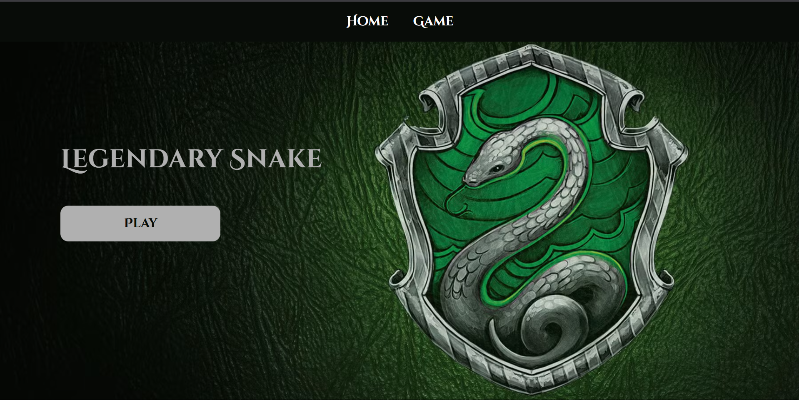
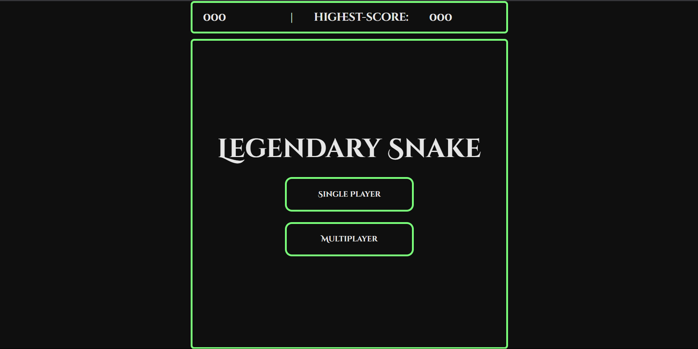

# legendary-snake

### Date: 29/06/2025

### By: Hussain Ahmed

### [Linkedin](https://www.linkedin.com/in/hussain-ahmed-655a20259/) | [Github](https://github.com/hussainmohd03)

---

### 🐍 **_Description_**

A browser-based implementation of the classic Snake game, built using HTML, CSS, and JavaScript. Features single and two-player modes, score tracking, and a Slytherin-themed UI.

---

### 🔧 **_Technologies Used_**

- HTML
- CSS
- JavaScript

---

### 📐 Planning & Design

#### 🧠 Pseudocode


#### 🖼 Wireframes


---

### 🚀 **_Getting Started_**

#### **🔗 Play Online**

You can play the game live here:

- [Legendary Snake](https://legendarysnake.surge.sh/)

#### **🖥️ Run Locally**

- Clone the Repository

```bash
git clone https://github.com/hussainmohd03/legendary-snake

cd legendary-snake
```

- Open in Browser

```bash
open index.html => bash
start index.html => windows
```

---


---

### **_Screenshots_**

#### Home Page 



#### Game Page 




---

### **_Future Updates_**

- [] 🎮 Mobile-friendly touch controls
- [] 💥 Sound effects
- [] ⏸️ Pause Button
---

### **_Credits_**

- Font From 
- Slytherin Background 

