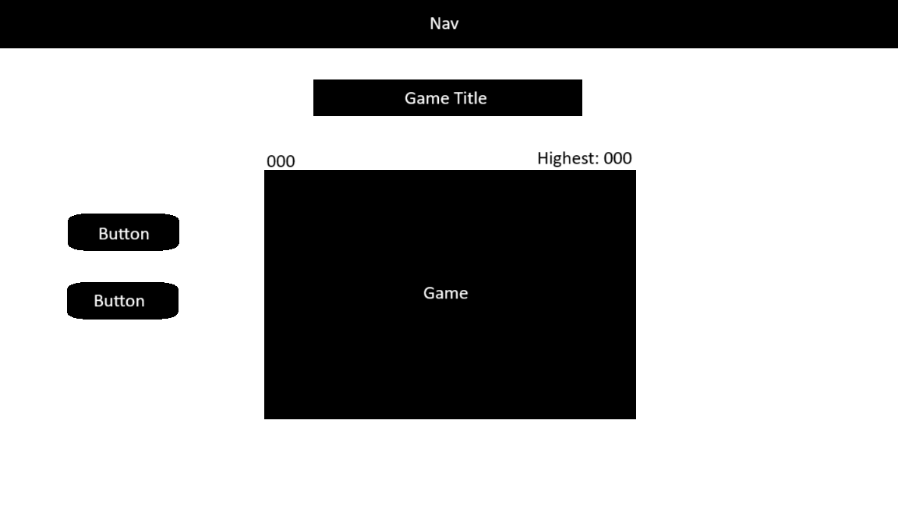
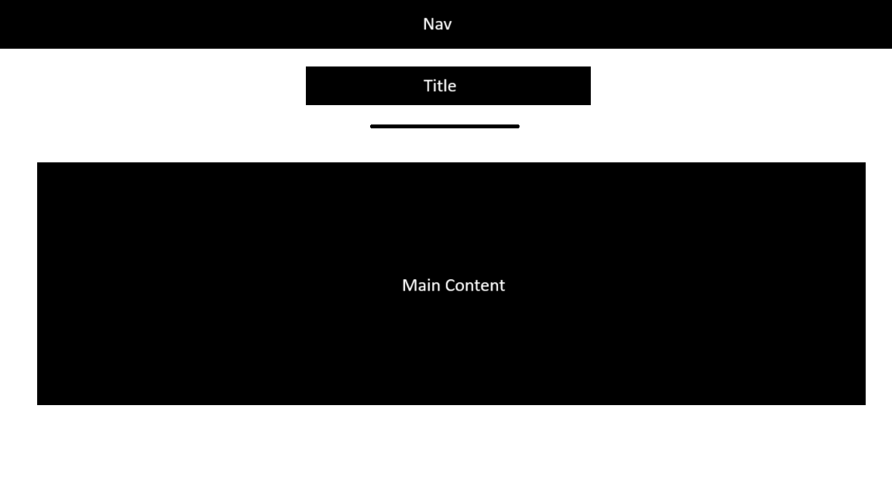

# legendary-snake

### Date: 29/06/2025

### By: Hussain Ahmed

### [Linkedin](https://www.linkedin.com/in/hussain-ahmed-655a20259/) | [Github](https://github.com/hussainmohd03)

---

### **_Description_**

A classic browser-based Snake game built with HTML, CSS, and JavaScript using DOM manipulation. Control the snake with arrow keys, eat food to grow, and avoid crashing into walls or yourself. Simple, responsive, and fun to play!

---

### 🚀 **_Getting Started_**

#### **🔗 Play Online**

You can play the game live here:

- [Legendary Snake](https://legendarysnake.surge.sh/)

#### **🖥️ Run Locally**

- Clone the Repository

```bash
git clone https://github.com/hussainmohd03/legendary-snake

cd legendary-snake
```

- Open in Browser

```bash
open index.html => bash
start index.html => windows
```

---

### **_Technologies Used_**

- HTML
- CSS
- JavaScript

---

### **_Screenshots_**

#### Main Page Wireframe



#### Instructions Page Wireframe



---

### **_Future Updates_**

---

### **_Credits_**
